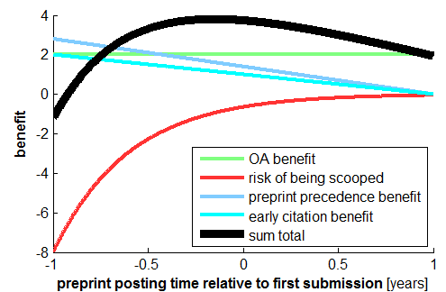

class: center, middle

<image src="images/eScience_Logo_RGB_PP.png">

# Reproducibility and Open Science

# XXX Replace link below!

<small>Follow along at: <a href="https://uwescience.github.io/ros-roadshow">https://uwescience.github.io/ros-roadshow</small>

---

<image src="images/DSE-and-sponsors.png" height=200px>

#### $ 37.8M for 5 years: <a href="http://msdse.org/">"Moore-Sloan Data Science Environments"</a>

Additional funding from
 - Washington Research Foundation  
 - National Science Foundation

#### Reproducibility and Open Science Working Group:

 - https://reproduciblescience.org/

 - Mailing list: reproducible@uw.edu

---

layout: true

<image src="images/escience-network.png" width=500px style="opacity:0.2;filter:alpha(opacity=20);"> 

---

# What does Reproducible Research mean?

### .blue[Ability to determine exactly how scientific results were obtained.]

 - Basis of scientific method.

 - Required for confidently building on past results.

 - Critical for accountability in engineering analysis / decision making.

---

template: meaning1

### .red[Standards and best practices in computational/data science are not yet well codified.]

 - Experimental science: Lab notebooks, methodology section of publications, etc.

 - Mathematics: Proofs are required in publications.

---

name: crotty1

Quote from .blue[Reproducible Research: A Cautionary Tale]

By David Crotty, March 26, 2014 on the [scholarly kitchen blog](https://scholarlykitchen.sspnet.org/2014/03/26/reproducible-research-a-cautionary-tale/)

.red["If your experiment consists of running numerical data through an algorithm,
then releasing your data and your code allows others to quickly verify that
you’ve done what you’ve said you’ve done.]
But when it comes to other types of research,
wet bench experiments or observational
work for example, reproduction is not quite so simple."

---

template: crotty1

#### .red[If only it were so easy in computational/data science!]

---

## Outline

 - .blue[Goal:] Stimulate discussion and share ideas  

     - Types of reproducibility
     - Tools for reproducibility

 - .blue[Data:] archiving, curation, sharing
 - .blue[Code:] scripting, versioning, collaborating, sharing, publishing
 - .blue[Publication:] open access

---

name: private1

## Private reproducibility...

Use scripts, not GUIs, for data analysis and visualization.

Use version control / provenance tracking tools.

Archive code and data used for published results.

.blue[Why?]

 - Ability to check results in prior publication,

 - Ability to build on your own past research of your own
   (or students / collaborators).

 -  Easily modify tables/figures to satisfy referees, etc.

---

template: private1

#### .red[Auditable Research:]
Even if code and data are not shared, there should be a
permanent record that can be checked.

.blue[Analogous to lab notebooks.]

---

name: public1

## Public Reproducibility...

Allowing others to reproduce your results.

(Readers, referees, researchers down the hall...)

.blue[Why?]

 -  Verifying scientific integrity of results.

 -  Aids in understanding ideas, implementing methods

 -  Increases impact of work.

---

template: public1

&nbsp;

.red[
"An article about computational result is advertising, not scholarship. The actual scholarship is the full software environment, code and data, that produced the result."
]

<a href="http://biostatistics.oxfordjournals.org/content/11/3/385.long">Buckheit and Donoho (1995) </a>

---

name: topten1

## .blue[Compare to Mathematics]

Traditional research in Mathematics is reproducible...

 - A paper containing a new theorem cannot be published without the proof.

---

template: topten1

### .blue[It wasn't always so...]

There is no . . . mathematician so expert in his science, as to place entire
confidence in any truth immediately upon his discovery of it. . . . Every
time he runs over his proofs, his confidence encreases; but still more by
the approbation of his friends; and is raised to its utmost perfection by
the universal assent and applauses of the learned world.

 - [David Hume, 1739](http://www.gutenberg.org/files/4705/4705-h/4705-h.htm)

---

## .blue[Compare to Mathematics]

Many arguments against publishing code might be applied to proofs in an
alternate universe...

["Top Ten Reasons To Not Share Your Code (and why you
should anyway)", SIAM News, April, 2013](http://sinews2.siam.org/DetailsPage/tabid/607/ArticleID/386/Top-Ten-Reasons-To-Not-Share-Your-Code-and-why-you-should-anyway.aspx)

 - The proof is too ugly to show anyone else.

 - I didn't work out all the details.

 - I didn't actually prove the theorem - my student did.

 - Giving the proof to my competitors would be unfair to me.

 - The proof is valuable intellectual property.

 - Etc.

---

name: pillars1

### The pillars of reproducible and open science

<image src="images/gorgolewski-poldrack-three-pillars.png" height=400px>

 <a href="http://biorxiv.org/content/early/2016/02/12/039354.full.pdf+html">Gorgolewski and Poldrack (2016)</a>

---

### .blue[Making your software available]

The broader open source software community has worked out a lot of the issues
around making code available and broadly useful.

--

- Version control

---

 ### Version control does *not* mean...

 

 http://www.phdcomics.com/comics/archive.php?comicid=1531

---

 ## <a href="https://git-scm.com/">Git</a>

 

---

### .blue[Making your software available]

The broader open source software community has worked out a lot of the issues
around making code available and broadly useful.

- Version control

--

- Automated software testing

---

### Software testing

--

Write code that checks that our code does what we expect it to do

--

We all do this anyway...

--

Formalize this and keep running the tests every time you make changes to the
software

--

[Continuous integration](https://en.wikipedia.org/wiki/Continuous_integration)

---

### .blue[Making your software available]

The broader open source software community has worked out a lot of the issues
around making code available and broadly useful.

- Version control

- Automated software testing

--

- Software licensing

---

### Things to consider when licensing your code

http://www.astrobetter.com/blog/2014/03/10/the-whys-and-hows-of-licensing-scientific-code/

--

- Code without a license is *closed code*

--

- Use a license that is broadly compatible (*do not make up your own license!*)

--

- Consider using a permissive (e.g, BSD) license, rather than a "copyleft" license

--

### Licensing makes your software useful to others, while maintaining your rights as the creator of the software.

---

### .blue[Making your software available]

The broader open source software community has worked out a lot of the issues
around making code available and broadly useful.

- Version control

- Automated software testing

- Software licensing

--

- Release with semantic versioning

---

### Semantic versioning

Is a way to communicate about your softwares readiness for use by others

--

0.1 => "Here it is! Have fun, but don't expect me to support your particular use, or to keep this API"

--

1.0 => "This is serious, and I intend to keep these APIs around for a while"

--

1.1 => "A few additional features, but API is preserved"

--

2.0 => "We might have broken some of our APIs since 1.1"

--

### http://semver.org/

---

### Make your software citeable!

To proceed in the academic career ladder, we need signals that our work is meaningful and useful

--

Especially pertinent if some aspects of your software work are not captured by traditional peer-reviewed publications

--

.red[**Software papers**] give you a line in your CV, and allow others to cite their dependence on your software (independently from their inspiration by your findings).

---

# Software journals

https://www.software.ac.uk/which-journals-should-i-publish-my-software

--

### [Journal of Open Source Software](http://joss.theoj.org/)

--

### How to cite software

https://github.com/uwescience/citing_software

---

## .blue[Making your data available]

### Data Curation

### [Ten Simple Rules for the Care and Feeding of Scientific Data](http://dx.doi.org/10.1371/journal.pcbi.1003542)

by Alyssa Goodman, Alberto Pepe , Alexander W. Blocker, Christine L.
Borgman, Kyle Cranmer, Merce Crosas, Rosanne Di Stefano, Yolanda Gil, Paul
Groth, Margaret Hedstrom, David W. Hogg, Vinay Kashyap, Ashish Mahabal,
Aneta Siemiginowska, Aleksandra Slavkovic,

PLOS Computational Biology 10(2014), e1003542.
http://dx.doi.org/10.1371/journal.pcbi.1003542

---

## Data Curation

### [Ten Simple Rules for the Care and Feeding of Scientific Data](http://dx.doi.org/10.1371/journal.pcbi.1003542)

 - Rule 2.  Share Your Data Online, with a Permanent Identifier

 - Rule 4. Publish Workflow as Context

 - Rule 5. Link Your Data to Your Publications as Often as Possible

 - Rule 6. Publish Your Code (Even the Small Bits)

 - Rule 7. State How You Want to Get Credit

 - Rule 8. Foster and Use Data Repositories

---

## Data Repositories

 -  .blue[Open Science Framework:] https://osf.io/  

    Slides by Kara Woo in
    [eScience Reproducibility and Open Science Seminar](http://karawoo.com/escience-osf-seminar/osf_talk_20160412.html)

 - .blue[UW ResearchWorks:] https://researchworks.lib.washington.edu/  

   - Ex: Ocosta School tsunami study,
     https://digital.lib.washington.edu/researchworks/handle/1773/24054

   - Ex: Human neuroimaging data,
     https://digital.lib.washington.edu/researchworks/handle/1773/33311

 - .blue[figshare:] https://figshare.com/  

 - .blue[Zenodo:] https://zenodo.org/  
     - Ex: Clawpack software at http://dx.doi.org/10.5281/zenodo.50982

     - Ex: Code, data, and Jupyter notebooks for a paper:
       http://faculty.washington.edu/rjl/pubs/KLslip/index.html

---

## Domain-specific repositories

### Geosciences:

-  .blue[DesignSafe:] https://www.designsafe-ci.org/  

-  .blue[Community Surface Dynamics Modeling System] 
   (CSDMS): http://csdms.colorado.edu Data and model repositories, 
   Web interface to some models

### Neuroscience:

- .blue[Collaboration in Computational Neuroscience:] https://crcns.org/  

- .blue[Open fMRI:] https://openfmri.org/  

---

## Data availabilty confers a citation advantage

### [Sharing Detailed Research Data Is Associated with Increased Citation Rate](http://dx.doi.org/10.1371/journal.pone.0000308)

Piwowar HA, Day RS, Fridsma DB (2007) PLoS ONE 2(3): e308. http://dx.doi.org/10.1371/journal.pone.0000308

--

A collection of links on the topic: http://opcit.eprints.org/oacitation-biblio.html

---

### Baking in reproducibility from the start

--

- Organize your data in a manner that will make sharing easy.

--

- Develop your software using git/Github. Use private repos during development, if you must (https://education.github.com/)

--

- Use tools that facilitate open communication around code, data and results.

---

## Literate programming

### [Jupyter](http://jupyter.org/)

A notebook format that supports reproducibility by interweaving code, data and
figures.

40 different languages are supported, including Julia, Python and R, and many
others ([Matlab](https://github.com/Calysto/matlab_kernel) too!).

---

## Example

Evaluating the Accuracy of Diffusion MRI Models in White Matter

http://dx.doi.org/10.1371/journal.pone.0123272

--

### Code: https://github.com/vistalab/osmosis

### Notebooks: https://github.com/vistalab/osmosis/tree/master/doc/paper_figures

### Data: https://purl.stanford.edu/ng782rw8378

---

## Dependency hell

--

To run these notebooks, you have to install all my dependencies.

--

To reproduce my results, you have to download my code, and my data, to your
machine.

--

If my code has compiled components, you'll need to compile it.

--

If you happen to have a different operating system, different compiler,
different libraries, etc... we might be out of luck!

---

## Tools to mitigate dependency hell

--

### .blue[Virtualization]

 - Package code along with complete environment

 - E.g., VirtualBox, VMware, etc.

 - Docker

--

### .blue[Cloud computing]

 - E.g., Amazon EC2, Windows Azure, etc. + VM

--

### .blue[Web platforms for running code]

 - E.g., RunMyCode.org, wakari.io
 - SageMathCloud: https://cloud.sagemath.com

---

# Binder

http://mybinder.org

Developed by the <a href="https://www.janelia.org/lab/freeman-lab">Jeremy Freeman's Lab</a> at Janelia Farms

Provisions a GitHub repository as a cloud-computing environment

--

For example, [here](http://mybinder.org/repo/cranmer/ligo-binder) is a binder
that will run the LIGO analysis that confirmed the existence of gravitational
waves (The Github repository is [here](https://github.com/cranmer/ligo-binder)).

---

## Making your publications available

### .red[Publish in open access journals]

--

### .red[Use preprint servers]:

Make your work available *before it is published*

https://arxiv.org/
http://biorxiv.org/

--

Provides access to your work

--

Establishes precedence

---

## When should I preprint?

https://nikokriegeskorte.org/2016/03/13/the-selfish-scientists-guide-to-preprint-posting/

---

## Summary and conclusions

- Reproducibility is a cornerstone of science.

--

- Think about reproducibility when you start your project and bake it in.

--

- Make your data, code and papers open and available, so that others can build on your work.

--

- Come and talk to us!

---

### Reproducibility and Open Science Working Group:

 - https://reproduciblescience.org/

 - Mailing list: reproducible@uw.edu,
   https://mailman11.u.washington.edu/mailman/listinfo/reproducible

### Come to our office hours!

http://escience.washington.edu/office-hours/

---

### Feedback on this talk?

We're eager to hear! And you can post issues/questions here: https://github.com/rjleveque/2016-ros-amath/issues

---

class: center, middle

# More materials

---

Lorena Barba's top ten readings on reproducibility:

https://medium.com/@lorenaabarba/barba-group-reproducibility-syllabus-e3757ee635cf#.x1w245xvg

---

## Some Git references

 -  [List of 10 recommended tutorials](http://sixrevisions.com/resources/git-tutorials-beginners/)

 -  https://help.github.com/categories/bootcamp/

 -  http://git-scm.com/book/en/Getting-Started-Git-Basics

 -  [Github online tutorial](http://try.github.com/)

### More general resources, including Git:

 -  [Software Carpentry](http://software-carpentry.org/)

 -  [Code Academy](https://www.codecademy.com/)

---
